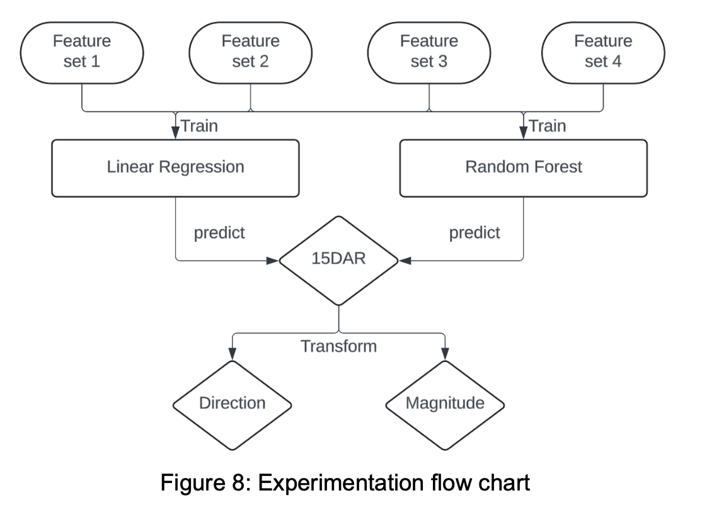
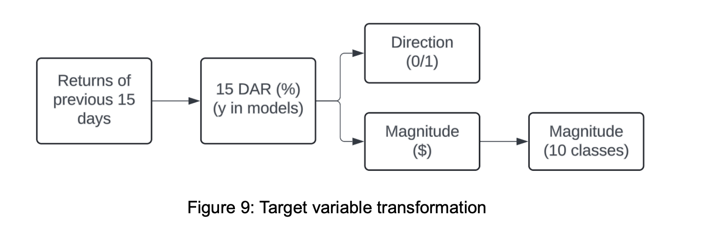
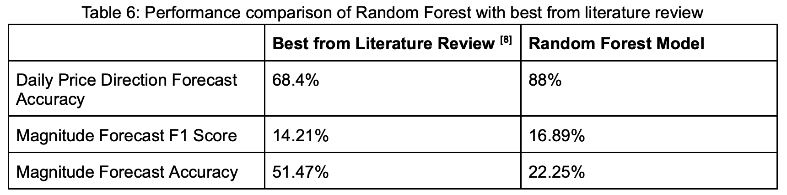
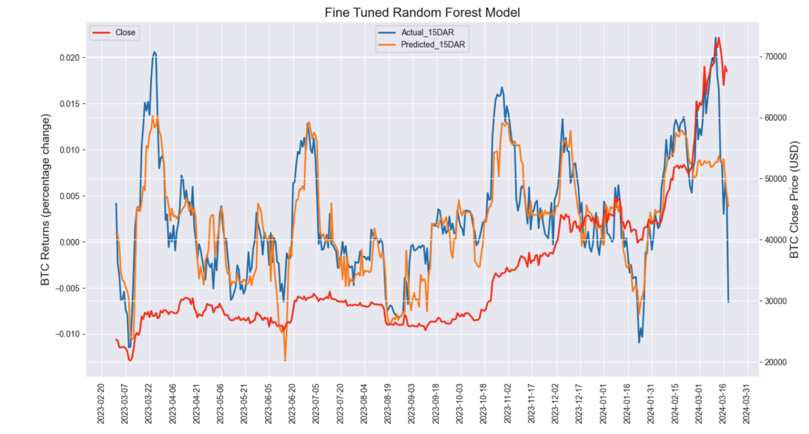

# Abstract
In this study, we carefully explored the relationship between cryptocurrency returns and human sentiment [1]. Our approach involved integrating established market indicators with sentiment data from various sources, including Bitcoin price data from Yahoo Finance, news data from the TIINGO News API, Twitter sentiment from Bloomberg, and Google Trends information, following a detailed review of relevant literature. We focused on enhancing the prediction of Bitcoin’s 15-day moving average daily return (15DAR), a metric chosen for its potential to moderate the market's inherent volatility. Our methodology included the use of four distinct feature sets, each designed to provide different insights into market behaviors. We employed both a foundational linear regression model and a more detailed Random Forest model, rigorously testing each for consistency and stability across diverse data sets. To demonstrate the practical application of our findings, we also conducted a sample trading strategy. This strategy helped confirm the feasibility of using our models in real-world trading scenarios, supporting the credibility of our research while carefully managing claims about its potential impact.

# Data Sources

# Train Test Split
Our dataset was split into two parts: training data from April 15, 2021, to March 1, 2023, and testing data from March 1, 2023, to March 19, 2024. We meticulously ensured that no future information influenced the model by lagging all features by one day, ensuring predictions for any given day were based solely on data available up to the end of the previous day. Additionally, for rolling sums and averages, we dropped initial data points to ensure each calculation was based on a complete set of information, thereby preventing any potential data leakage and maintaining the integrity of our testing process.

# Experiments

# Predicted 15DAR transformation

# Results

# Conclusion
Our study has developed a nuanced approach to cryptocurrency prediction, harnessing a broad spectrum of data inputs including social media trends, news sentiment, and search behaviors. While our analysis methods and feature engineering techniques differ from those commonly reported in the literature, they have allowed us to effectively capture and model the dynamic nature of cryptocurrency markets.

Particularly, the engineering and integration of memory features [14] — which provide historical context to the current data points — has shown to be beneficial, enhancing our model's ability to anticipate future market movements. Although comparing our results directly with those from existing studies is challenging due to methodological differences, our approach has demonstrated substantial promise.

The refined Random Forest model, equipped with these memory features and further enhanced by BERT classifiers for deeper sentiment analysis, over the traditional VADAR [15] model, has exhibited robust performance. This performance is carefully quantified without overstating outcomes, reflecting improvements in both predictive accuracy and interpretational clarity.

Our application of this model in a demonstrative trading strategy, which also includes comparisons to conventional market strategies like the S&P 500 buy-and-hold, has illustrated its practical value. The strategy's successful performance further validates the model's effectiveness, balancing risk and return in a manner comparable to established financial benchmarks.

Ultimately, this study contributes a carefully validated, effective model for predicting Bitcoin returns, suggesting pathways for future research in this complex field. By blending sophisticated machine learning techniques with a clear, interpretable modeling approach, we aim to enhance the strategic toolkit available to investors navigating the volatile cryptocurrency markets.

# References
See report 